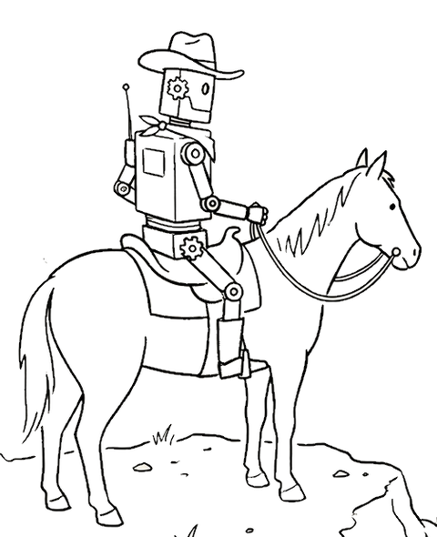

# paniolo



Agent-controlled target machine wrangler for low-level software development.

"Paniolo" is Hawaiian for cowboy. For bootloader, firmware, and OS bring-up
work, it lets an AI agent netboot the target, watch its output, send it input,
and power-cycle it, with no human in the loop.

<br clear="left">

## See it work

An agent on a laptop drives an Intel NUC's firmware setup in another room: it
exits setup, catches `F2` during POST through the KVM's emulated keyboard,
confirms by OCR that it is back in setup, then clicks with an absolute mouse:


```console
$ paniolo hid send -t lab-nuc-1 key ENTER          # discard & exit → the NUC reboots
$ for i in $(seq 30); do paniolo hid send -t lab-nuc-1 key F2 >/dev/null; done
$ until paniolo video read lab-nuc-1 | grep -q -i "bios version"; do sleep 2; done
$ paniolo hid send -t lab-nuc-1 moveabs 19583 5871 ; paniolo hid send -t lab-nuc-1 click left
```

More on the [demos page](https://curtisgalloway.github.io/paniolo/demos/).

---

## Capabilities

| Subsystem | Commands | What it does |
|---|---|---|
| [Netboot](https://curtisgalloway.github.io/paniolo/netboot/) | `paniolo netboot` | DHCP + TFTP + HTTP netboot over a direct USB-Ethernet link (Raspberry Pi; UEFI PXE / HTTP Boot) |
| [Remote labs](https://curtisgalloway.github.io/paniolo/distributed-control/) | `paniolo --lab …` | Drive targets on remote control hosts over SSH from one git-tracked lab file |
| [Control hosts](https://curtisgalloway.github.io/paniolo/control-host/) | `paniolo skill control-host` | Blank Raspberry Pi to agent-reachable control host in one human action (stock Pi OS plus a cloud-init seed) |
| [Link mode](https://curtisgalloway.github.io/paniolo/netif/) | `paniolo netif` | Switch the link between netboot, ffx-over-IPv6, `link`, and `off` modes; `down-hard` forces a real carrier drop (WoL off + admin-down) |
| [Video](https://curtisgalloway.github.io/paniolo/video/) | `paniolo video` | HDMI capture daemon; on-device OCR |
| [Serial](https://curtisgalloway.github.io/paniolo/serial/) | `paniolo serial` | Serial console: interactive (tio) or a daemon with a timestamped log |
| [Power control](https://curtisgalloway.github.io/paniolo/power/) | `paniolo power on/off`, `paniolo power-cycle`, `paniolo power-state`, `paniolo serial dtr/reset` | DTR power button (J2 header) and shell-command hooks; helpers `cambrionix` (hub ports), `zigplug` (Zigbee plugs), `shellyplug` (Shelly Gen2+), `amt` (Intel AMT/vPro) |
| [HID injection](https://curtisgalloway.github.io/paniolo/hid/) | `paniolo hid` | USB keyboard/mouse injection via a helper (`hidrig` KB2040 injector, or `ch9329` for Openterface Mini-KVM / KVM-Go and Sipeed NanoKVM-USB) |
| [Switchable USB media](https://curtisgalloway.github.io/paniolo/usb/) | `paniolo usb` | Switch a KVM-Go's microSD card between control host and target, as boot media |
| [adb (Android targets)](https://curtisgalloway.github.io/paniolo/adb/) | `paniolo adb` | Drive an Android DUT over one USB cable: console (`shell`/`run`), screen (`screencap`), input |
| [Dashboard](https://curtisgalloway.github.io/paniolo/dashboard/) | `paniolo console` | Video + serial web UI; auto-starts daemons; `-i <name>` preselects a serial interface |
| Agent skills | `paniolo skill` | List the bundled agent guides, or print one's `SKILL.md` |
| Lab config & diagnostics | `paniolo target`/`host`/`config`, `paniolo discover`, `paniolo configure`, `paniolo doctor`, `paniolo daemons` | Manage the lab file, discover hardware, check config against reality, list and restart daemons |
| [Exit status and errors](https://curtisgalloway.github.io/paniolo/errors/) | `paniolo --json-errors …` | Exit codes name the failure kind; `--json-errors` adds a one-line JSON object |

A **target** (DUT, device under test) is the machine being developed on; a
**control host** is the machine cabled to it.

---

## Installation

### macOS: Homebrew

The tap installs a prebuilt universal binary (Apple Silicon and Intel):

```bash
brew tap curtisgalloway/tap
brew install paniolo
```

Upgrade with `brew upgrade`. Run `paniolo setup` once after installing: it
setuid-installs `netbootd-bpf-helper` (one sudo) and the optional zigplug helper.

`brew install --HEAD paniolo` builds `main` from source, the same path as
`make install` below.

### Linux: apt repository

On Debian 12+ / Raspberry Pi OS (amd64/arm64), use the signed apt repository;
upgrade with `apt upgrade`:

```bash
sudo install -d /etc/apt/keyrings
sudo curl -fsSL -o /etc/apt/keyrings/paniolo.asc https://curtisgalloway.github.io/paniolo/apt/paniolo.asc
sudo tee /etc/apt/sources.list.d/paniolo.sources >/dev/null <<'EOF'
Types: deb
URIs: https://curtisgalloway.github.io/paniolo/apt
Suites: stable
Components: main
Signed-By: /etc/apt/keyrings/paniolo.asc
EOF
sudo apt update && sudo apt install paniolo
```

### A new Raspberry Pi control host

For a blank Pi, skip the steps above: flash stock Raspberry Pi OS, drop four
seed files on its boot partition, and power on. It comes up with SSH
authorized and the release `.deb` installed. See
[standing up a control host](https://curtisgalloway.github.io/paniolo/control-host/);
the exact commands, including how to pick the right SD card, are in
`paniolo skill control-host`.

### Release packages

Each [GitHub Release](https://github.com/curtisgalloway/paniolo/releases) has
a `.deb` and a tarball: `sudo apt install ./paniolo_<version>_<arch>.deb`.

After the apt repository or a release package, run `paniolo setup` once: it
sets group membership and installs the optional zigplug helper.

### From source

Requirements:

- macOS 10.14 (Mojave) or later, or Linux (x86-64 / arm64)
- [Homebrew](https://brew.sh) (macOS only)
- Rust toolchain (`brew install rustup` on macOS, or `rustup.rs` on Linux)
- On Linux: `sudo apt-get install pkg-config libudev-dev libclang-dev cmake nasm`
  (`make install` checks for these and tells you what's missing)

```bash
git clone https://github.com/curtisgalloway/paniolo ~/src/paniolo
cd ~/src/paniolo
make install           # paniolo CLI + daemons + OCR helper, in one step
```

`make install` bootstraps the CLI with `cargo install --path cli`, then runs
`paniolo setup`, which builds and installs the rest. Where things land:

- **The `paniolo` CLI** is the only thing on PATH (`~/.cargo/bin`).
- **Daemons and helpers** (`hdmicap`, `serialcap`, `netbootd`, `cambrionix`,
  `hidrig`, `ch9329`, `shellyplug`, `amt`) and **the OCR helper** (`visionocr`
  on macOS via `swiftc`, `linuxocr` on Linux) go in
  `~/.local/libexec/paniolo/bin`, off PATH. Run one with
  `paniolo helper <name> [args…]` (no name lists them).
- **Bundled agent skills** go in `~/.local/share/paniolo/skills` (the
  `.deb`/tarball ship them under `/usr/share/paniolo/skills`).
  `paniolo skill [NAME]` lists or prints them.
- **On macOS**, `setup` also installs `netbootd-bpf-helper` setuid-root (one
  sudo) for `netbootd`.
- **Configuration** is one CLI-managed lab file
  (`~/.config/paniolo/lab.toml`); see
  [notes/config-redesign.md](notes/config-redesign.md).

The only Python component is the optional `zigplug` helper, which `setup`
installs as a uv tool. After pulling or editing, re-run:

```bash
make install           # rebuilds and reinstalls everything (idempotent)
```

`make rust` rebuilds only the Rust crates (no OCR/setuid/zigplug steps);
`make help` lists every target. To install one component directly, helpers
need `--root` so they land in libexec:

```bash
cargo install --path ~/src/paniolo/cli        # if the CLI changed
cargo install --path ~/src/paniolo/hdmicap   --root ~/.local/libexec/paniolo  # if hdmicap changed
cargo install --path ~/src/paniolo/serialcap --root ~/.local/libexec/paniolo  # if serialcap changed
cargo install --path ~/src/paniolo/netbootd  --root ~/.local/libexec/paniolo  # if netbootd changed (re-run `paniolo setup` to re-setuid the helper on macOS)
cargo install --path ~/src/paniolo/cambrionix --root ~/.local/libexec/paniolo # if cambrionix changed
cargo install --path ~/src/paniolo/hidrig    --root ~/.local/libexec/paniolo  # if hidrig changed
cargo install --path ~/src/paniolo/ch9329    --root ~/.local/libexec/paniolo  # if ch9329 changed
cargo install --path ~/src/paniolo/shellyplug --root ~/.local/libexec/paniolo # if shellyplug changed
cargo install --path ~/src/paniolo/amt       --root ~/.local/libexec/paniolo  # if amt changed
UV_TOOL_BIN_DIR=~/.local/libexec/paniolo/bin uv tool install --force ~/src/paniolo/zigplug # if zigplug changed
```

---

## Remote control pattern

An agent or script on a dev machine SSHes into the control host:

```bash
# Configure target once
ssh control-mac "paniolo target add target-machine"
ssh control-mac "paniolo netboot set -t target-machine --interface en3 --tftp-root ~/pxe"
ssh control-mac "paniolo power set -t target-machine --cycle-cmd /path/to/power-cycle.sh"

# Deploy a new kernel and boot
TFTP_ROOT=$(ssh control-mac "paniolo netboot tftp-root target-machine")
scp out/kernel.img control-mac:"${TFTP_ROOT}/kernel_2712.img"
ssh control-mac "paniolo netboot start target-machine"
ssh control-mac "paniolo netboot logs -f target-machine"

# Interact with the console
ssh control-mac "paniolo serial log -t target-machine -i console --tail 50"

# Power cycle and repeat
ssh control-mac "paniolo power-cycle target-machine"
```

---

## Documentation

Full documentation:
**[curtisgalloway.github.io/paniolo](https://curtisgalloway.github.io/paniolo/)**
(source in [`docs/`](docs/README.md)).

- **User guides:** linked in the [capabilities table](#capabilities).
- **[Demos](https://curtisgalloway.github.io/paniolo/demos/)** and
  **[tested hardware](https://curtisgalloway.github.io/paniolo/hardware/)**.
- **[Glossary](https://curtisgalloway.github.io/paniolo/glossary/):** the
  hardware, protocol and paniolo terms these docs use.
- **Developer docs:** start with the
  [**architecture overview**](https://curtisgalloway.github.io/paniolo/dev/architecture/),
  then the [requirements tracker](https://curtisgalloway.github.io/paniolo/dev/requirements/).
  Source in [`docs/dev/`](docs/dev).

[`notes/`](notes/README.md) holds point-in-time design records and bring-up
findings. They are not kept current and not published.

---

## License

Apache 2.0 — see [LICENSE](LICENSE).
