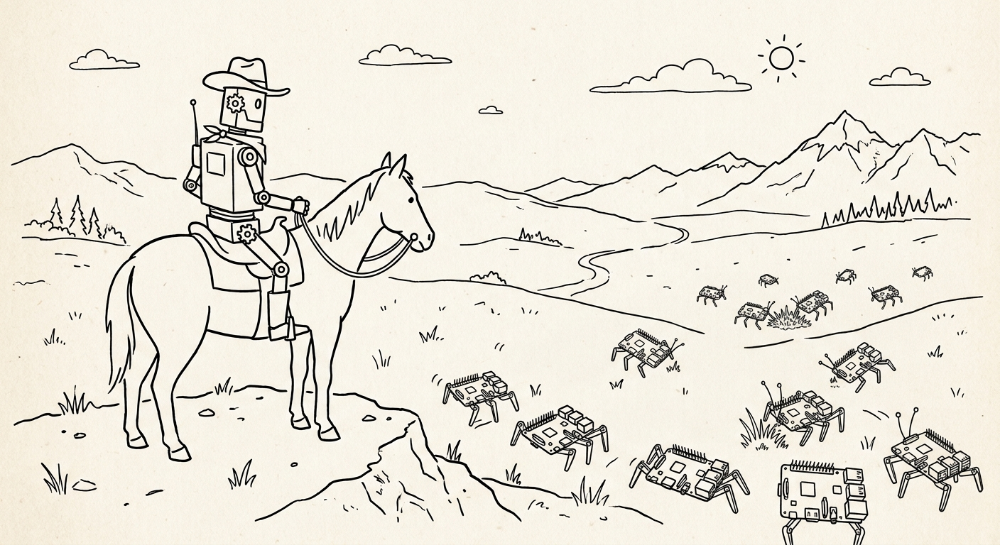

# Paniolo documentation



Paniolo lets an AI agent (or you) netboot a target machine, watch its output, send it input,
and power-cycle it, with no person at the bench.

- **Install:** see the root
  [`README.md`](https://github.com/curtisgalloway/paniolo/blob/main/README.md), or on
  Debian/Raspberry Pi OS the [apt repository](https://curtisgalloway.github.io/paniolo/apt/).
- A *target* (DUT) is the machine you develop on; a *control host* is the machine cabled to it;
  a *channel* is one connection to a target (power, serial, video, hid, …).
- Unfamiliar term? See the [glossary](glossary.md).

## Start here

| Doc | What it covers |
|---|---|
| [Tested hardware](hardware.md) | Bench hardware each subsystem is verified with, with purchase links. |
| [Demos](demos.md) | Recorded runs from the CI rack, each capture beside the agent's transcript. |

## Naming the target

Runtime commands take the target positionally or as `-t/--target`, not both:

```bash
paniolo video stop target-machine        # positional
paniolo video stop -t target-machine     # the same command
```

Omit it entirely when the lab has exactly one target.

Two exceptions:

- The **config** verbs (`set`, `add`, `rm`) require `-t` and take no positional.
- `paniolo doctor [target]` is positional-only; with no target it checks them all.

## Exit status and errors

Exit codes name the failure kind (3 not configured, 4 control host unreachable, 100 daemon not
running, 101 hook failed, …); `--json-errors` adds a one-line JSON object. See
[Exit status and errors](errors.md).

## Subsystem guides

| Guide | Commands | Summary |
|---|---|---|
| [Netboot](netboot.md) | `paniolo netboot` | DHCP + TFTP + HTTP over a direct USB-Ethernet link (`netbootd`), incl. UEFI PXE / HTTP Boot. |
| [Link mode](netif.md) | `paniolo netif` | Switch the link between `netboot`, `link`, `ffx`-over-IPv6 (host `fe80::1`), and `off`; `down-hard` forces a real carrier drop. |
| [Serial](serial.md) | `paniolo serial` | `serialcap` daemon (JSONL log + WebSocket terminal) and interactive `tio`. |
| [Power](power.md) | `paniolo power on/off`, `power-cycle`, `power-state`, `serial dtr/reset` | DTR power button (J2) and shell-command hooks; helpers `cambrionix`, `zigplug`, `shellyplug`, `amt`. |
| [Video](video.md) | `paniolo video` | `hdmicap` HDMI capture + on-device OCR. |
| [Dashboard](dashboard.md) | `paniolo console` | Combined video + serial web UI. |
| [Switchable USB media](usb.md) | `paniolo usb` | Switch a KVM-Go's microSD card between control host and target, as boot media. |
| [HID injection](hid.md) | `paniolo hid` | USB keyboard/mouse injection via `hidrig` (KB2040) or `ch9329` (Openterface Mini-KVM / KVM-Go, Sipeed NanoKVM-USB). |
| [adb (Android targets)](adb.md) | `paniolo adb` | Console (`adb shell`/`run`), screen (`screencap`), and input (`adb input`) over one USB cable. |

## Distributed control (Phases 0–5 shipped)

| Doc | What it covers |
|---|---|
| [Distributed control: one lab, one file](distributed-control.md) | Driving targets on remote control hosts over SSH from one git-tracked lab file: `--lab`, tunnelled `console`, remote `setup --host`, `discover`/`configure`. |
| [Standing up a control host](control-host.md) | Blank Raspberry Pi to control host with the cloud-init seed in [`packaging/host-seed/`](https://github.com/curtisgalloway/paniolo/tree/main/packaging/host-seed); sizing; first-boot failures. |

## Developer documentation

Source: [`docs/dev/`](https://github.com/curtisgalloway/paniolo/tree/main/docs/dev).

| Doc | What it covers |
|---|---|
| [**Architecture**](dev/architecture.md) | Deployment, CLI and daemons, config/state, data flows, host-OS differences. **Read this first.** |
| [Requirements & progress](dev/requirements.md) | Requirements tracker: shipped, planned, and decided, with status per item. |

### Interfaces

| Doc | What it covers |
|---|---|
| [HID serial protocol](dev/hid-serial-protocol.md) | Normative command vocabulary (v1) that `hidrig` and `ch9329` speak. |
| [OCR helper protocol](dev/ocr.md) | The OCR helper contract and engines (Apple Vision, `Windows.Media.Ocr`, Tesseract). |
| [HID dual-board design](dev/hid-dual-board-design.md) | The KB2040 rig's I2C1 wire format between control and target boards. |
| [CLI error contract](dev/error-contract/design.md) | Design of the exit-code-by-kind and `--json-errors` contract; the user-facing reference is [errors.md](errors.md). |

### Extending paniolo

| Doc | What it covers |
|---|---|
| [Adding a power-control helper](dev/adding-power-helpers.md) | Hook contract, helper conventions, skeletons (Rust/Python), verification, PR checklist. |
| [Agent discoverability & usage evals](dev/agent-evals.md) | No-hardware eval: can a naive agent find the right command from `--help` → `paniolo skill` → docs? |
| [Serial agent benchmark](dev/serial-agent-benchmark.md) | Hardware eval: paniolo vs. improvising vs. `fx serial` on serial tasks. |

### Hardware-CI integration (in design)

Exposing paniolo's primitives to hardware-CI orchestrators, without owning test orchestration.

| Doc | What it covers |
|---|---|
| [Gap analysis](dev/ci-integration/gap-analysis.md) | Per-primitive (power/serial/deploy/boot) × per-ecosystem (KernelCI/LAVA, Fuchsia/botanist) deltas. |
| [Integration design](dev/ci-integration/design.md) | Device-control API + LAVA and botanist adapters. |
| [Related work: paniolo vs. labgrid](dev/ci-integration/related-work.md) | paniolo compared with labgrid and Redfish. |
| [Redfish provider (design sketch)](dev/ci-integration/redfish-provider.md) | A Redfish API in front of BMC-less boards for Ironic/Metal3/LAVA. |

## Notes: design records & bring-up findings

Point-in-time records in [`notes/`](https://github.com/curtisgalloway/paniolo/tree/main/notes).
They are **not** kept current and not published.

| Doc | What it covers |
|---|---|
| [Config redesign: a CLI-managed lab](https://github.com/curtisgalloway/paniolo/blob/main/notes/config-redesign.md) | Lab data model, CRUD commands, per-channel dispatch, and the Python→Rust rewrite plan (the `cli/` crate). |
| [CH9329 driver spec (clean-room)](https://github.com/curtisgalloway/paniolo/blob/main/notes/ch9329-spec.md) | WCH CH9329 serial protocol (frame format, GET_INFO, keyboard report, parameter-config/baud, reset, ACK codes); implemented as the [`ch9329`](https://github.com/curtisgalloway/paniolo/blob/main/ch9329/README.md) helper. |
| [Openterface deep control — findings & testing TODO](https://github.com/curtisgalloway/paniolo/blob/main/notes/openterface-deep-control.md) | **Partially verified (tracker §6.1 OTF-1)**: DTR unplug/replug of the A-port device works but is unstable; MS2109 GPIO mux blocked; the `????????` serial is a RAM descriptor; RTS→CH9329 reset untested. |
| [Distributed-control implementation plan](https://github.com/curtisgalloway/paniolo/blob/main/notes/distributed-control-plan.md) | The original Python-era phased plan for [distributed control](distributed-control.md); superseded for mechanism details. |
| [UEFI HTTP Boot design](https://github.com/curtisgalloway/paniolo/blob/main/notes/uefi-http-boot-design.md) | The design netbootd's UEFI support was built from; shipped behavior is in [netboot.md](netboot.md). |
| [Openterface KVM-Go — architecture and paniolo support](https://github.com/curtisgalloway/paniolo/blob/main/notes/openterface-kvm-go.md) | MS2130S capture + CH32V208 emulating CH9329; both paniolo channels work unmodified. |
| [Console front door](https://github.com/curtisgalloway/paniolo/blob/main/notes/console-front-door.md) | **Parked design**: one stable port with server-side fan-out, replacing `?serialws=` stitching. |
| [Openterface USB mux spec (clean-room)](https://github.com/curtisgalloway/paniolo/blob/main/notes/openterface-usb-mux-spec.md) | The KVM-Go microSD serial command (shipped as the `usb` channel) and the Mini-KVM USB-A register write (untested). |
| [Provisioning a Linux control host](https://github.com/curtisgalloway/paniolo/blob/main/notes/control-host-provisioning.md) | The design behind the cloud-init seed; the `pi-sd` flavor shipped (see [control-host.md](control-host.md)), the x86 flavor is unbuilt. |
| [Pi 4 control host](https://github.com/curtisgalloway/paniolo/blob/main/notes/pi4-control-host.md) | Pi 4 control-host bring-up plan; the USB-HID-gadget backend is not implemented. |
| [VM targets and RFB](https://github.com/curtisgalloway/paniolo/blob/main/notes/vm-targets-and-rfb.md) | **Design only.** VMs as targets, and RFB (the VNC protocol) as a second transport for video and HID. Only the pty serial console shipped. |
| [Openterface Mini-KVM V2 on Linux](https://github.com/curtisgalloway/paniolo/blob/main/notes/openterface-v2-linux-serial.md) | **Bench-measured.** Why the V2's control port is silent on Linux while the same unit works on macOS; root cause not yet established. Corrects two claims in other notes. |
| [A desktop app for the lab](https://github.com/curtisgalloway/paniolo/blob/main/notes/desktop-app.md) | **Design only.** A Tauri desktop app as the lab's front door, building on [console front door](https://github.com/curtisgalloway/paniolo/blob/main/notes/console-front-door.md). |

## Elsewhere in the repo

- **Agent skills** in [`skills/`](https://github.com/curtisgalloway/paniolo/tree/main/skills): `paniolo` (driving a target), `kvm-puppeting` (GUI puppeting), `control-host` (building a control host). `paniolo skill` lists them; `paniolo skill <name>` prints one's `SKILL.md`.
- [`AGENTS.md`](https://github.com/curtisgalloway/paniolo/blob/main/AGENTS.md): internals, source constraints, adding a subsystem.
- [`hidrig/README.md`](https://github.com/curtisgalloway/paniolo/blob/main/hidrig/README.md): HID injector CLI and daemon; board and firmware are in [`paniolo-hardware`](https://github.com/curtisgalloway/paniolo-hardware) (`hidrig-kb2040/`).
- [`docs/provenance/`](https://github.com/curtisgalloway/paniolo/tree/main/docs/provenance): the pinned source files read for each clean-room spec, for verifiers.

---

*These docs describe paniolo's current, verified state. When you change a subsystem, update its
guide and the [architecture overview](dev/architecture.md); when scope changes, update the
[tracker](dev/requirements.md). Plans and findings go in
[`notes/`](https://github.com/curtisgalloway/paniolo/tree/main/notes).*
