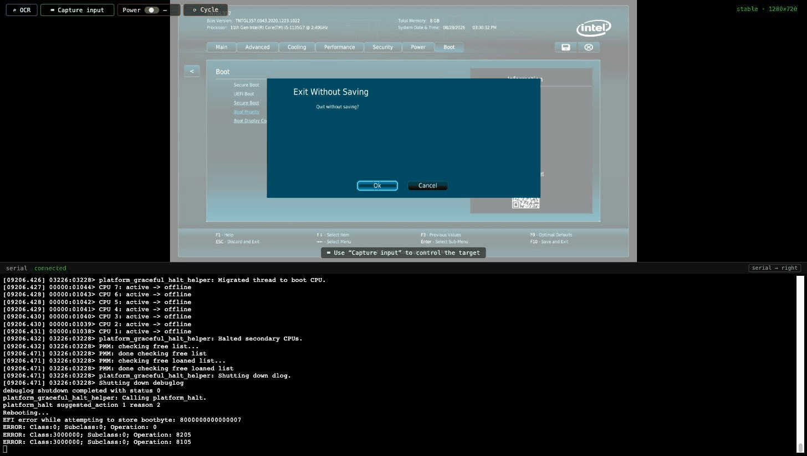
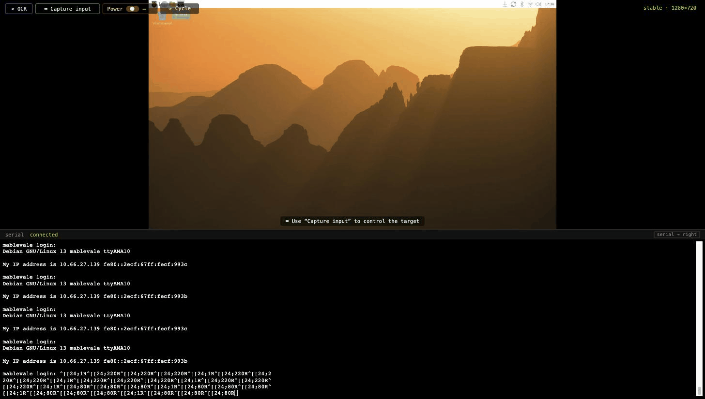
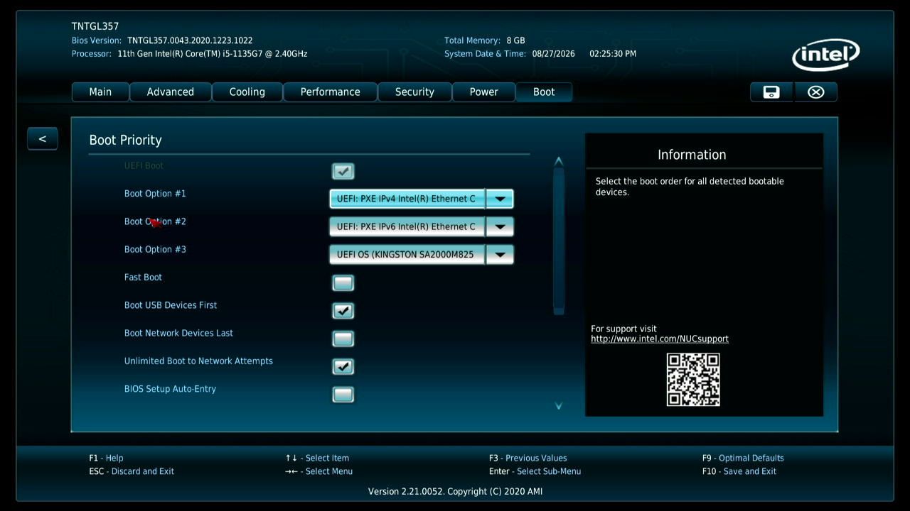

<!--
SPDX-FileCopyrightText: 2026 Curtis Galloway
SPDX-License-Identifier: Apache-2.0
-->

# Demos

Recordings from the CI rack, made from a laptop with the boards in another
room. Every command is a real `paniolo` invocation, dispatched over SSH to the
Raspberry Pi control host that owns the cables. Where a demo drives a screen,
the capture is followed by the transcript of what the agent typed — static
text, so you can read it at your own pace while the capture loops.

The transcripts are the terminal output of the asciinema casts in
[`docs/demo/`](https://github.com/curtisgalloway/paniolo/tree/main/docs/demo)
(`asciinema play docs/demo/<name>.cast`), ANSI stripped, otherwise untouched.

## Puppeting the NUC BIOS

`lab-nuc-1` — Intel NUC11, AMI visual BIOS, Sipeed NanoKVM-USB · channels:
video + OCR, hid, serial.

The one that is genuinely hard to automate. The NUC is parked in firmware
setup; the agent OCRs the page, discards and exits, then hammers `F2` through
the KVM's emulated keyboard during POST and waits for the firmware to come
back — verified by reading the screen, not by sleeping. Then absolute-mouse to
the Boot tab, into Boot Priority, OCR the boot order, and back out without
saving. In the capture you can watch the reboot: setup → black → Intel splash →
setup again, then the mouse clicks landing. The OCR lines are verbatim
Tesseract output from the control host, stray glyphs included.



```console
# lab-nuc-1 is an Intel NUC11 on the CI rack, parked in BIOS setup from an earlier take.
# Read the screen through the HDMI capture (OCR runs on the control host):
$ paniolo video read lab-nuc-1 | head -4
‘TNTGL357 |
Bios Version: TNTGL357.0043.2020.1223.1022 Total Memory: 8 GB tt >
Processor: 11th Gen Intel(R) Core(TM) i5-1135G7 @ 2.40GHz System Date & Time: 08/28/2026 03:30:25 PM intel >) |
| Main Advanced ‘Cooling Performance “Security Power Boot a ©

# Discard & exit to reboot it, then catch F2 during POST — the part that is hard to automate.
$ paniolo hid send -t lab-nuc-1 key ESCAPE
OK
$ paniolo hid send -t lab-nuc-1 key ESCAPE
OK
$ paniolo hid send -t lab-nuc-1 key ENTER
OK
$ for i in $(seq 30); do paniolo hid send -t lab-nuc-1 key F2 >/dev/null; done

# Wait for the firmware to come back, verified by OCR rather than a sleep:
$ until paniolo video read lab-nuc-1 | grep -q -i "bios version"; do sleep 2; done; paniolo video read lab-nuc-1 | head -3
TNTGL357
Bios Version: TNTGL357.0043.2020,1223.1022 Total Memory: 8 GB “7 >
Processor: 11th Gen Intel(R) Core(TM) i5-1135G7 @ 2.40GHz System Date & Time: 08/28/2026 03:30:52 PM Cntel >)

# In. Now drive it: absolute mouse to the Boot tab, then Boot Priority.
$ paniolo hid send -t lab-nuc-1 moveabs 19583 5871
OK
$ paniolo hid send -t lab-nuc-1 click left
OK
$ paniolo hid send -t lab-nuc-1 moveabs 5350 13970
OK
$ paniolo hid send -t lab-nuc-1 click left
OK
$ paniolo video read lab-nuc-1 | grep -i -E "boot option|pxe|kingston|fast boot"
Fast Boot i)

# Nothing to change today — back out without saving.
$ paniolo hid send -t lab-nuc-1 key ESCAPE
OK
$ paniolo hid send -t lab-nuc-1 key ESCAPE
OK
$ paniolo hid send -t lab-nuc-1 key ENTER
OK

# done.
```

## Puppeting a live desktop

`lab-pi-1` — Raspberry Pi 5, Pi OS desktop, Sipeed KVM-USB · channels: video,
hid.

A KVM you can script. The pointer is absolute, so the agent parks it
mid-screen, clicks the terminal in the taskbar, and types into it keystroke by
keystroke over the wire — `echo`, then `uname -a` (note the `--`: everything
after it is text for the helper's `type`, not options) — then leaves the
desktop as it found it.



```console
# A live desktop, seen through a capture dongle, driven by emulated HID.
# The pointer is absolute — put it in the middle of the screen:
$ paniolo hid send -t lab-pi-1 moveabs 16000 16000
OK

# Open a terminal from the taskbar:
$ paniolo hid send -t lab-pi-1 moveabs 2560 546
OK
$ paniolo hid send -t lab-pi-1 click left
OK

# Type into it — keystroke by keystroke, over the wire:
$ paniolo hid send -t lab-pi-1 type echo driven by a keyboard that does not exist
OK
$ paniolo hid send -t lab-pi-1 key ENTER
OK
$ paniolo hid send -t lab-pi-1 type -- uname -a
OK
$ paniolo hid send -t lab-pi-1 key ENTER
OK

# Leave it as we found it:
$ paniolo hid send -t lab-pi-1 type exit
OK
$ paniolo hid send -t lab-pi-1 key ENTER
OK

# video + hid: a KVM you can script.  github.com/curtisgalloway/paniolo
```

## Out-of-band power over Intel AMT

`optiplex` — Dell OptiPlex 7060, Intel AMT/vPro, no plug and no relay ·
channel: power ([`amt` helper](power.md#intel-amt-power-control-amt)).

This box has no smart plug and no relay. Its power facility is the
Management Engine inside the chipset, reached over one ethernet cable, awake on
the standby rail even when the machine is off. `power off` kills it without
consulting the OS; `power-state` then reports **OFF** from the ME itself — real
readback, not a guess — and `power on` brings it back.

```console
# This target has no smart plug and no relay. Its power facility is
# Intel AMT: the Management Engine inside the chipset, reached over
# one ethernet cable — even when the machine is off.
$ paniolo power-state optiplex
Power ON  (optiplex)

# Kill it. The OS is not consulted.
$ paniolo power off optiplex
Powering off 'optiplex' via paniolo helper amt off -d 192.168.99.50 -u admin
power: off
Power off complete.
$ paniolo power-state optiplex
Power OFF  (optiplex)

# The host is dead — that answer came from the ME on the standby rail.
$ paniolo power on optiplex
Powering on 'optiplex' via paniolo helper amt on -d 192.168.99.50 -u admin
power: on
Power on complete.
$ paniolo power-state optiplex
Power ON  (optiplex)

# True out-of-band power with real state readback: paniolo's amt helper.
```

## Cold-booting a Pi and catching it die

`lab-pi-1` — Raspberry Pi 5, USB-C power through a relay board on the control
host, FTDI console · channels: power, serial.

`power-cycle` cuts VBUS, holds five seconds, restores it — and the serial
capture daemon records every byte of the cold boot. The transcript then greps
the log for the bootloader's `power-on-reset 1`, the proof it was a genuine
cold start, back to a login prompt in about 35 seconds.

```console
# lab-pi-1: a Raspberry Pi 5 on the CI rack, driven from another room.
# Its USB-C power feeds through a relay board on the control host.
$ paniolo power-state lab-pi-1
Power ON  (lab-pi-1)

# Cycle it, and catch the machine dying:
$ paniolo power-cycle lab-pi-1
Power cycling 'lab-pi-1' via python3 /home/curtisg/src/usb-relay/host/usbrelay.py --port /dev/serial/by-id/usb-Raspberry_Pi_Pico_503558607AC7371F-if02 cycle 1
OK cycle 1 5.0
Power cycle complete.
$ paniolo power-state lab-pi-1
Power OFF  (lab-pi-1)

# VBUS is cut. Five seconds later power returns, and the serial capture
# daemon records every byte of the cold boot. Waiting for the login prompt...
.....
$ paniolo serial log lab-pi-1 --since 175 | grep -E 'BOOTSYS release|power-on-reset|best-mode|kernel_2712.img|BL31|Debian GNU|login:' | head -12
[2026-08-28T00:56:38.774Z] #176       1.19 RPi: BOOTSYS release VERSION:086b83e3 DATE: 2026/05/26 TIME: 16:01:25
[2026-08-28T00:56:38.774Z] #180       1.21 POWER_OFF_ON_HALT: 0 WAIT_FOR_POWER_BUTTON 0 power-on-reset 1
[2026-08-28T00:56:43.249Z] #271       5.69 MESS:00:00:05.694778:0: HDMI0: best-mode 2 (limit 2) 1920x1080 60 Hz CEA modes 30001980078200f00100008010000000 extensions 1
[2026-08-28T00:56:44.919Z] #297       7.36 Loading 'kernel_2712.img' to 0x00000000 offset 0x200000
[2026-08-28T00:56:45.351Z] #298       7.15 Read kernel_2712.img bytes 10172022 hnd 0x13b43
[2026-08-28T00:56:46.267Z] #312     NOTICE:  BL31: v2.6(release):v2.6-240-gfc45bc492
[2026-08-28T00:56:46.267Z] #313     NOTICE:  BL31: Built : 12:55:13, Dec  4 2024
[2026-08-28T00:57:01.473Z] #315     Debian GNU/Linux 13 mablevale ttyAMA10
[2026-08-28T00:57:01.473Z] #319*    mablevale login:

# power-on-reset 1 — a genuine cold boot, back to a login prompt in ~35 s.
# serial + power + video + HID, one CLI:  github.com/curtisgalloway/paniolo
```

## Stills

Single frames from the same captures (1280×720) — lighter than any GIF, and
honest about what the capture path actually sees.

| | | |
|---|---|---|
|  |  |  |
| NUC11 firmware, Boot Priority — reached by mouse | The same NUC booted into Fuchsia | Pi OS desktop on lab-pi-1 |
